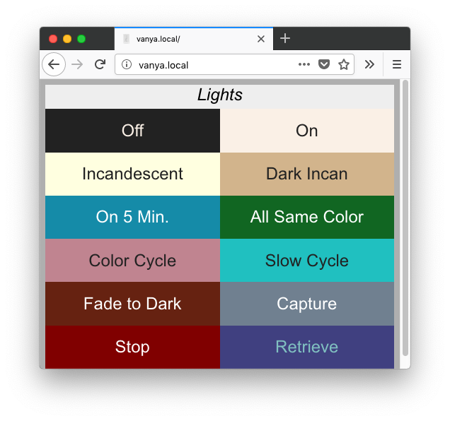

.. _main:

.. figure:: logo.png
   :align: center

   http://www.bardolph.org

************
Introduction
************

.. toctree::
   :maxdepth: 1
   :caption: Contents:

**Bardolph** is a facility for controlling `LIFX <https://www.lifx.com>`_ lights
through a simple scripting language. It can be used
to control lights in an automated way with a minimal
syntax. The intended audience is people who are pretty good with command-line
tools and have some kind of experience with scripting and/or software
development. It can also be used as an embedded low-level language for
communicating with the devices.

The program does not use the internet to access the bulbs, and no login is
required; all of its communication occurs over the local WiFi network. You
can edit a script with a basic text editor and run it from the command
line.

This project relies on the
`lifxlan <https://pypi.org/project/lifxlan>`_
Python library to access the bulbs. You need to have it installed for the code
in this project to run. If you run the web server, you will also need a couple
of other libraries from `PyPi <https://pypi.org>`_.

It probably lacks some of what you might expect of a scripting language,
but it's still under development. However, it is also very simple, and
should be usable by non-programmers.

.. index:: quick examples

Quick Examples
==============
The source distribution contains some samples in the `scripts` directory.
They should work with whatever lights are on the network.  For a more
complete description of the scripting langage, please see
:ref:`language`.

Here is a script, named `all_on.ls`, that will turn on all your lights:

.. code-block:: lightbulb

  duration 1.5 on all

The ``duration`` parameter causes the lights to power up over a period 1.5
seconds, which is a much nicer experience than abruptly turning them on
with no ramp-up.

This file is in the "scripts" directory, and you can run it with:

.. code-block:: bash

  lsrun scripts/all_on.ls

In this case, `lsrun` is a shell script that becomes available after you
install Bardolph. It is a thin layer that executes the `run.py` module.

Another example, `on5.ls`, turns on all the lights, waits for 5 minutes, and
then turns them all off again

.. code-block:: lightbulb

  duration 1.5 on all
  time {5 * 60} off all

To run it:

.. code-block:: bash

  lsrun scripts/on5.ls

The application executes in the foreground as long as a script is running. In
this example, the application will run for 5 minutes. However, it will spend
most of its time inside a `sleep()` call and won't burden the CPU. In my
experience, execution for the application takes up about 10% of the CPU
cycles on a Raspberry Pi Zero, depending on how active the running scripts
are.

You can kill the script and quit by pressing Ctrl-C. You may want to run the
program as a background job, which will terminate when the script is done.

As a convenience, you can pass a script as a command-line parameter using
`lsrun -s`, followed by the script code in a quoted string. For example, to
turn off all the lights from the keyboard:

.. code-block:: bash

  lsrun -s 'off all'

.. index:: web server; overview

Web Server
==========

The web server component makes scripts available in a user-friendly manner.
It implements a simple web page that lists available scripts and provides a
1:1 mapping betwen a script and a URL. The server is designed to run locally
on a WiFi network.

For example, if have a machine with the hostname
`myserver.local`, you could launch the  `all_on.ls` script by going to
`http://myserver.local/all-on` with any browser on your WiFi network.
The benefit here is the ability to launch a script using a simple
browser bookmark or desktop shortcut.

This is currently a somewhat advanced feature I. describe the process for
setting up a server
in :ref:`web_install`.

Python Interface
================
I've attempted to make it easy to embed Bardolph scripts in your Python code.
For some uses, this may be significantly easier than learning and using a
full-purpose Python API. For example, here's a complete program that
waits 5 seconds, turns all the lights off, and turns them on again after
another 5 seconds:

.. code-block:: python

  from bardolph.controller import ls_module

  ls_module.configure()
  ls_module.queue_script('time 5 duration 1.5 off all on all')

More information on using scripts in Python code is available in
:ref:`python_interface`.

.. index:: installation; quick

Quick Installation
##################
This section explains how to do an install for a quick tryout. For more
complete installation instructions, please see
:ref:`installation`. If you want to run the web server, see :ref:`web_install`.

Note that Python 3 is required in all cases. If your system defaults to
Python 2.x, there's a good chance that you'll need to use `pip3` instead of
`pip`. Notable culprits here are Raspbian and Debian.

.. code-block:: bash

    python -m venv .venv
    source .venv/bin/activate
    pip install bardolph

After this intallation, the `lsc`, `lsrun`, and `lscap` commands should be
available. In addition, if you're planning on using scripts in your Python
code, the Bardolph modules should be importable.

To be able to use these commands later on, you will always need make sure
the virtual environment is activated using the `activate` command. For more
information, including virtual environments, please see :ref:`installation`.

To get a copy of the sample scripts, you still need to download the source:

.. code-block:: bash

  git clone https://github.com/al-fontes-jr/bardolph

Testing the Installation
========================
To do a quick sanity check:

.. code-block:: bash

  lsrun -h

This should display a help message. To make sure Bardolph is able to access
your actual bulbs:

.. code-block:: bash

  lscap

This should give you a human-friendly listing of your bulbs, their state, and
which groups/locations they belong to.

The source distribution includes some examples in a directory named `scripts`.
For example:

.. code-block:: bash

    lsrun scripts/on-all.ls

or:

For a more colorful demonstration:

.. code-block:: bash

  lsrun scripts/cycle-color.ls

If you don't have any bulbs, or prefer not to change the color
of those you do have, use the "fakes" option:

.. code-block:: bash

  lsrun -f scripts/on-all.ls

The fake bulbs sent output to `stdout` that indiciates what commands
would normally be sent to the actual devices.

For full documentation on the command-line tools, please see
:ref:`command_line`.

Uninstall
=========
.. code-block:: bash

  pip uninstall bardolph

.. index:: system requirements

System Requirements
###################
The program should work on any systems with a recent enoug version of
Python, as listed on `PyPi <https://pypi.org/project/bardolph>_.` Because I
haven't done any stress testing, I don't know the limits on
script size. Note that the application loads the encoded script into memory
before executing it.

I've tested the program on a Raspberry Pi Zero W controlling 14 devices, a
Raspberry Pi Zero-W, 3 Model B+, and 4.

Supported Devices
=================
I have tested with the devices that I own, which includes the 1100-Lumen A19
light with the disk-shaped lens, and the 800-Lumen A19 "Mini" globe-shaped
bulb. All the bulbs I own are multi-colored, which means that I haven't done
any testing with "Day and Dusk" or "White" bulbs. I would expect them to
work ok, although I don't really know.

For multizone, I've done some testing with the Z LED strip, and it seems to
work well. I would expect it to work with other multizone lights.

Project Name Source
###################
`Bardolph <https://en.wikipedia.org/wiki/Bardolph_(Shakespeare_character)>`_
was known for his bulbous nose.
