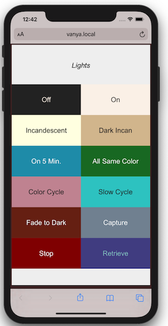
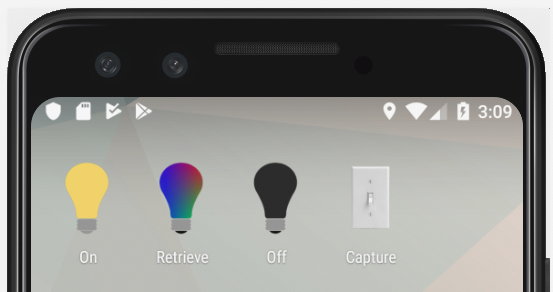
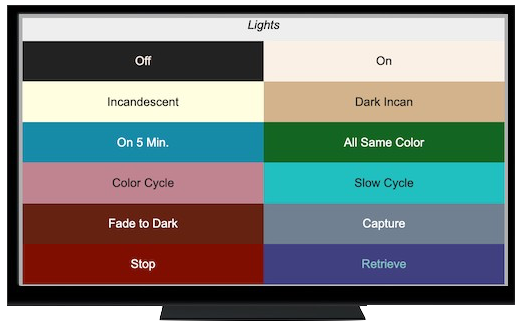

.. _web_server:

Web Frontend Server
###################

Part of the `Bardolph Project <http://www.bardolph.org>`_

I wrote this application for my own use, and it serves
as my primary means of controlling my lights. However, it is designed to
compliment the LIFX mobile app, not to replace it.

In comparison to the LIFX app, this local web server has these 
differences:

* Each script has its own URL. This makes it easy to access scripts with
  bookmarks and a web browser.
* After the bulbs boot up, there's no need for external Internet connectivity.
* I can acess the app from any browser in my apartment without logging in
  to anything.

For example, if you want to just turn off the lights, you may
find that navigating an app complicates a simple task. In my case,
I simply unlock the phone and turn off the lights off with a single 
tap on a home screen shortcut.

It's also convenient to access the lights from my smart TV's web
browser. When I sit down to watch a movie, I don't have to find
my phone to dim the lights; I just use the TV.

It's important to note that while this is a web server, it is not designed to
work on the public Internet. The server runs entirely within your WiFi
network. The target configuration is a very inexpensive device which
runs 24/7 as a headless server. At home I use a dedicated Raspberry Pi W
that sits in a corner of my apartment.

Running the Server
##################
The server executes within the 
`Flask framework <https://flask.palletsprojects.com>`_. If you run it,
you may want to become familiar with Flask.

Development Mode
================
You can run the server in so-called "development mode". Because the
server will run on a local network, the issues around security and
scalability are less of a concern. However, I would still recommend that
you run the server with some kind of a HTTP tier on port 80. Below you
can find instructions on configuring lighthttpd do fulfill that role on
a Raspberry Pi.

For experimenting and development, you may just want to stick with
development mode. To do that, first:

.. code-block:: bash

  pip install Flask flup lifxlan

This installs the Python libraries that the Bardolph code relies on.

Log Configuration
=================
By default, the logs are written to `/var/log/lights/lights.log`.
Therefore, you need a directory `/var/log/lights` which is writeable.

On MacOS, I first create a RAM drive with this command:

.. code-block:: bash

  diskutil erasevolume HFS+ rdisk `hdiutil attach -nomount ram://2048`

I then create a symbolic link with:

.. code-block:: bash

  sudo ln -s /var/log/lights` to `/Volumes/rdisk`

On a default Raspbian installation, there's already a ram disk, and the
command is:

.. code-block:: bash

  sudo ln -s /var/log/lights` to `/dev/shm`

Starting the Server
===================
To start the server in that manner,  cd to the Bardolph
home directory. Then:

.. code-block:: bash

  source web/setenv
  flask run

The `setenv` script sets some environment variables used by Flask when
running the server. After you start the server, you can access it with:
http://localhost:5000.

To stop the server,  press Ctrl-C.
  
Everyday Configuration
----------------------
If you're going to use the web server as an everyday utility, you
should follow the complete installation instructions.

Manifest
========
The file `manifest.json` in the `scripts` directory contains the list of
scripts that should be available on the web site. That list also contains 
metadata for the scripts, mostly to control the appearance of their links. 

For example:

::

  // ...
  {  
    "file_name": "all_off.ls",
    "repeat": false,
    "path": "off",
    "title": "All Off",
    "background": "#222",
    "color": "Linen"
  },
  // ...

This snippet is used to launch the script "all-off.ls". Because "repeat" is
false, the script is run only once when you access the URL. 

The "path" setting determines the path on the web site that runs this script.
In this example, you would go to http://localhost:5000/off.

The string from "Title" appears in a colored box on the web page. That box
is is filled with the color specified by "background". The title is displayed
using the value from "color" for the text. In both cases, the strings for
colors correspond to CSS colors and are basically sanitized and passed
through to the web page.

The manifest file contains standard JSON, as expected by the `json.load`
function in the Python standard library. The "repeat" value is optional,
and is assumed to be false if not present.

Default Behavior
================
For many scripts, default behaviors can be used to simplify the manifest:

::

  // ...
  {  
    "file_name": "reading.ls",
    "background": "#222",
    "color": "Linen"
  },
  // ...

If no value is supplied for "title", the server will generate it from the
name of the script. It will replace any underscore or dash with a space, and
capitalize each word. For example, `reading.ls` yields "Reading", 
while `all-off.ls` yields "All Off".

The default for "path" is the base name of the file. In these examples, the URL's
would be http://localhost:5000/reading and http://localhost:5000/all-off.

The default for "repeat" is false.

Usage
=====
Clicking on a script button queues up the associated file containing that
script. Subsequent clicks append scripts to the end of the queue. As each
script finishes, the server executes the next in line.

Some scripts are run as repeatable: they are immediately started again when 
they have finished executing. Such scripts are designed to run continuously 
until stopped from the outside.

Aside from listing the scripts which are contained in the manifest, the home page
also has some special-purpose buttons.

The "Stop" button immediately stops the current script and clears the queue of
all others. Because a script can potentially run indefinitely, you may need
this button if you want to access the lights immediately, or use an LIFX
app to control them. This button is the default mechanism for stopping a
repeatable script, which by design never stops.

The "Capture" button causes the server to query the lights and generate
a script that reflects their current settings. That file is
`scripts/__snapshot__.ls`. Clicking on "Retrieve" runs that script, thus
restoring the saved state.

Although the index page has no link to it, a page at http://server.local/status
lists the status of all the known lights in a very plain output with no CSS.

LIFX Apps
=========
Bardolph does nothing to directly interfere with the operation of the apps provided
by LIFX. However, a running script will continue to send commands to the bulbs.
Therefore, if you want to use the LIFX app or any other software, such as HomeKit
or Alexa, you should hit the "Stop" button on the Bardolph web site. Alternatively,
if you shut down the web server, that will also prevent it from sending any
more commands to the lights.

System Structure
################
This section gives a quick overview of the system architecture,
provided here for informational purposes.

The server stack has the following arrangement:

* The core Bardolph code that parses and runs scripts.
* An application server implemented in Python uses Flask to generate
  HTML pages. In the process of satisfying each page request, the server
  typically launches a lightbulb script.
* A WSGI layer, implemented by flup, which is part of the Python code.
  The Flask framework feeds generated web pages into this layer, which
  then makes them available via the WSGI protocol.
* A FastCGI (FCGI) process, created by spawn-fcgi, which connects to the
  WSGI layer and provides a FCGI interface. As part of its startup, spawn-fcgi
  launches the Python interpreter, runing the code for the Bardolph web server.
* An HTTP server, lighttpd, which is a separate process. It connects to the
  FCGI process and accepts connections over port 80. The HTTP server
  passes requests for web pages to the FCGI process, which gets the
  response from the Python code. While generating that response, the Python
  code will usually either launch or stop a lightbulb script.

That response is then passed up the chain to the user's browser.

HTTP Considerations
===================
You can use  a different WSGI container and/or FastCGI integration. 
For an example, see the integration with flup as implemented in
`wsgy.py`, in the root of the source distribution.

The files included in the bardolph source tree under `web/server` are
specific to lighttpd, but may be helpful for other containers. This just
happens to be how my own server at home is configured.
